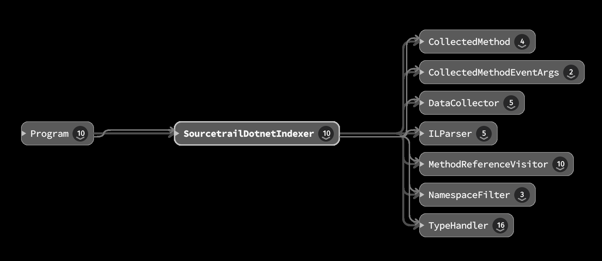

What
----
**SourcetrailDotnetIndexer** is a command-line tool takes a .NET assembly as input and generates a database that can be loaded with [Sourcetrail](https://www.sourcetrail.com/).\
It uses reflection to collect all types from the assembly and also parses the IL-Code of methods.

It uses [SourcetrailDB](https://github.com/CoatiSoftware/SourcetrailDB) for writing the database.\
For convenience, the native DLL for *SourcetrailDB* is already included, so you don't have to build it yourself.\
Note, the native DLL is a x64 DLL so in your project settings, you have to specify x64 as the target platform as well.

Why
---
This project arose from an attempt to visualize the class-relationships for a large legacy .NET Application.\
After previous attempts with [Graphviz](https://graphviz.org/) and similar free tools (like [Gephi](https://gephi.org/) and [yEd](https://www.yworks.com/products/yed)) failed
(albeit powerful in their domain, the results were not what i had in mind), i found *Sourcetrail* and it was exactly what i needed.

Disclaimer
----------
This tool **does not** parse source-code, it just takes a compiled assembly.\
This means, there will be no source-code integration available in *Sourcetrail*.\
On the other hand, this means it **should** work with all kinds of .NET assemblies, 
regardless of the language they are created from (e.g. C#, VB.NET, ...)
but i tested in only with a handful of assemblies generated from C#.\
Feel free to open a pull-request if you encounter any flaws.

Building
--------
Open the `.sln` in VisualStudio and build.

Usage
-----
The following command-line arguments are supported:

* -i `assembly-path` \
  specifies the path to the input-assembly, from which the sourcetrail-database is generated.
* -s `search-path`\
  path to load referenced assemblies from \
  this option may be specified multiple times.\
  e.g `-s C:\Windows\Microsoft.NET\Framework64\v4.0.30319`
* -f `name-filter`\
  a string (in regex-format) to specify namespaces, that should be ignored when generating the database. \
  this option may be specified multiple times. \
  e.g. `-f ^System -f ^Microsoft`
* -o `output-path`\
  specifies the path, where the database is written to.\
  the output filename is always the name of the assembly with the extension `.srctrldb`.\
  note that *SourcetrailDB* automatically creates a file with the `.srctrlprj` extension in the same folder,
  this is the file you load in *Sourcetrail*.
* -w\
  if specified, waits for the user to press enter before exiting.\
  intended when running from inside VS to keep the console-window open.

Results
-------
This is an image taken from sourcetrail after creating the database for **SourcetrailDotnetIndexer** itself.

